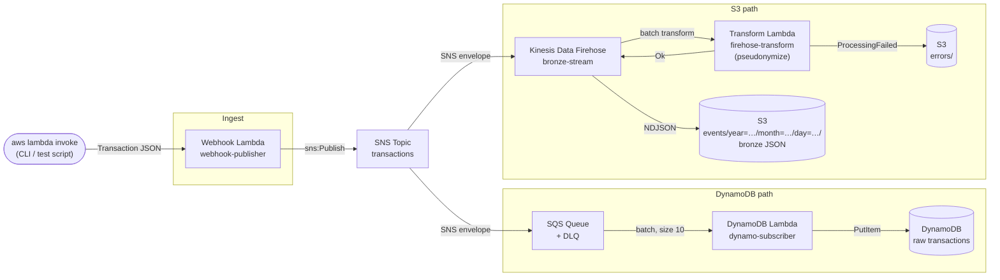

# webhook-sns-dynamo-bronze-poc

Proof of concept for a webhook-triggered event fan-out pipeline. A single Lambda invocation publishes a transaction event to SNS, which fans out to two independent subscribers: one persisting raw data to DynamoDB, one pseudonymizing and delivering to S3 bronze storage via Kinesis Data Firehose.

## Architecture



### Components

| Component | Role |
|---|---|
| **Webhook Lambda** | Entry point. Accepts a `Transaction` payload and publishes it raw to SNS. |
| **SNS Topic** | Fan-out hub. One publish reaches all subscribers simultaneously. |
| **SQS + DLQ** | Buffers messages for the DynamoDB path. Provides durable retry and dead-letter on repeated failure. |
| **DynamoDB Lambda** | Unwraps SNS envelope, writes the full raw `Transaction` to DynamoDB. |
| **DynamoDB** | Raw, unmodified event storage. Every field preserved. |
| **Kinesis Data Firehose** | Buffers and batches events for the S3 path. Invokes the Transform Lambda inline before delivery. Uses dynamic partitioning to derive Hive-style S3 prefixes from `occurredAt`. |
| **Transform Lambda** | Pseudonymizes each record: hashes PII fields, drops sensitive free-text, enforces required partition-key fields. |
| **S3 (bronze)** | Pseudonymized events in NDJSON, partitioned by event date. Schema matches raw events. |

## Pseudonymization

Field-level rules are configured via `FIELD_RULES` (env var on the Transform Lambda):

```json
{
  "$.occurredAt":       "partition-key",
  "$.accountId":        "hash",
  "$.customerId":       "hash",
  "$.counterpartyIban": "hash",
  "$.description":      "drop",
  "$.counterpartyName": "drop",
  "$.bankReference":    "drop"
}
```

| Action | Behaviour |
|---|---|
| `partition-key` | Keep the field. Fail the record (`ProcessingFailed`) if absent or null — prevents silent mispartitioning. |
| `hash` | Replace value with HMAC-SHA256 hex digest. Deterministic: same input → same hash across events, enabling cross-event correlation without exposing the original value. |
| `drop` | Remove field from output entirely. |
| `keep` | Pass through unchanged (default for unlisted fields). |

> **Note:** This is pseudonymization, not anonymization. Hashed values are stable and reversible with the key. The HMAC secret is hardcoded in this PoC — production use would source it from AWS Secrets Manager.

## Technology Choices

| Concern | Choice | Rationale |
|---|---|---|
| Infrastructure | Pulumi (TypeScript) | Type-safe infrastructure, same language as Lambda handlers |
| Lambda runtime | TypeScript (Node.js 20) | Shared types between infra and handlers; AWS SDK v3 included in runtime |
| Fan-out primitive | SNS | Publisher stays decoupled from subscriber count; one-to-many is SNS's core job |
| DynamoDB path buffering | SQS + DLQ | Durable retry, configurable backpressure, independent dead-letter queue |
| S3 path delivery | Kinesis Data Firehose | Managed batching (64MB / 60s), inline Lambda transform, dynamic S3 partitioning — no S3 SDK code needed |
| Bronze format | JSON (NDJSON) | Schema-free; bronze must faithfully mirror raw events as they evolve. Parquet/Iceberg is deferred to silver layer jobs. |
| Partitioning | Hive-style (`year=` / `month=` / `day=`) | Compatible with Athena, Glue, and most query engines out of the box |
| Field selection | JSONPath selectors (`$.field`) | Supports future nested field references without changing the engine |

## Event Schema

```typescript
interface Transaction {
  transactionId: string;       // UUID — also used as S3 object name
  accountId: string;           // hashed in bronze
  customerId: string | null;   // hashed in bronze
  occurredAt: string;          // ISO 8601 — partition key for Firehose
  settledAt: string | null;
  amountCents: number;
  currency: string;
  balanceAfterCents: number | null;
  balanceCurrency: string;
  description: string;         // dropped in bronze
  transactionType: "TRANSFER" | "CASH" | "CREDITCARD" | "DEBITCARD" | "FEES" | "INTEREST" | "PAYMENT";
  status: "settled" | "pending" | "booked" | "captured" | "authorised" | "received";
  accountBic: string;
  counterpartyName: string;    // dropped in bronze
  counterpartyIban: string;    // hashed in bronze
  counterpartyBic: string;
  bankReference: string | null; // dropped in bronze
  eventId: string;
  isInternal: boolean;
}
```

## Usage

### Prerequisites

- Node.js 20+
- Pulumi CLI
- AWS credentials configured (see `.env.example`)

### Setup

```bash
cp .env.example .env
# edit .env with your AWS profile and region

npm install
npm run build

source .env
pulumi stack init dev
pulumi up
```

### Generate test data

```bash
# Send 200 transactions with 20 concurrent invocations
npm run generate -- --count 200 --concurrency 20

# Dry-run to inspect generated payloads
npm run generate -- --count 5 --dry-run
```

### Tear down

```bash
source .env && pulumi destroy
```
